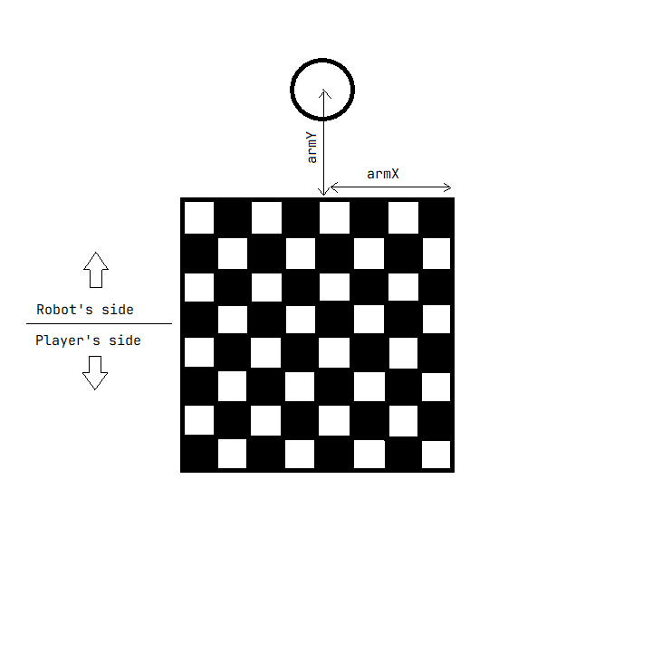

# Software Setup
To build and run this project, you will need the following software -

1. Python 3.7+
2. Arduino IDE
3. Git (optional, helps to clone the source code)
4. Stockfish executable (optional, but recommended)

The stockfish executable is needed if you want to use Stockfish to find moves for the arm instead of the default chess engine. The default chess engine is experimental, and Stockfish definitely plays better than it. For instructions on how to use Stockfish with the arm, take a look at the [stockfish](./stockfish.md) page.

Once you have assembled the arm and the chess board accoring to the instructions given on the [assembly](./assemble.md) page, follow the below steps to set up the software needed to play a game with the arm.

## Python Setup  
**Step 1** - Download Python  
Download and install Python (version >= 3.7) from [python.org/downloads](https://python.org/downloads)

**Step 2** - Source Code  
Get the source code for the arm from this project's repository by running 
```bash
git clone https://github.com/hrushikeshrv/charm.git
```
or by downloading the repository as a .zip archive from [github.com/hrushikeshrv/charm/archive/refs/heads/main.zip](https://github.com/hrushikeshrv/charm/archive/refs/heads/main.zip)

**Step 3** - Virtual Environment  
Create a virtual environment for installing the dependencies for this project. You can use any virtual environment manager you like. The easiest way is to use venv. Run the following command inside the repository folder you just cloned -

```bash
python -m venv venv
```

**Step 4** - Activate Environment  
Before running the arm's Python code, remember to activate the virtual environment.

For Windows, activate by running -
```
venv\scripts\activate
```

For Linux/MaxOS, activate by running -
```bash
source venv/bin/activate
```

This virtual environment will need to be activated each time you open a new terminal/shell instance.

**Step 5** - Install Dependencies  
Once you have activated your virtual environment, you can install the dependencies this project needs. Run the following command in the root directory of the project -

```bash
pip install -r requirements.txt
```

That's it for the Python setup!

## Arduino IDE

**Step 1** - IDE Download  
Download the Arduino IDE from [arduino.cc](https://www.arduino.cc/en/software)

**Step 2** - Connect Arduino  
Connect your Arduino Uno to your computer. 

The Arduino code included in this repository is specific to an Arduino Uno. If you want to use another Arduino model with the arm, you should make sure that your model has a sufficient number of GPIO pins to be able to interface with all of the electronic components the arm needs.

The current design needs at least 14 GPIO pins, excluding the Tx and Rx GPIO pins. Moreover, if you use another Arduino model instead of the Uno, you will need to update the pin numbers assigned in the [`controller/controller.ino`](https://github.com/hrushikeshrv/charm/tree/main/controller) file with the pin numbers you are using for each component.

You can use the [circuit schematic](./data/schematics/chessbot.kicad_sch) to help. The pins are configured as `const int`'s near the begining of the sketch, and there are comments describing which electronic component each pin is connected to.

**Step 2** - Modify Sketch  
The Arduino code controls the arm's movement, for which it needs to know the dimensions of the chess board. In particular, it needs to know how big one square of the chess board is. 

Open the [`controller/controller.ino`](https://github.com/hrushikeshrv/charm/tree/main/controller) file in the Arduino IDE, and look for the `SQUARE_WIDTH` variable. Set it to be the width of one square of the chess board you are using (measured in centimeters).

The arm is designed for a standard size chess board, where one square has a side of around 5 cm. If you are using a board with side _smaller_ than 5 cm, you may need to modify the design of the arm's gripper, since it may be too big for the board and may knock pieces over when it makes a move. If your board has a square  width larger than 5 cm, the gripper should be fine.

You will also need to tell the arm where it is positioned relative to the chess board. Measure the distance `armX` and `armY` as shown in the diagram below -



Look for the variable `ARM_X` in the sketch and set it to the value of the measured `armX` distance, and look for the variable `ARM_Y` in the sketch and set it to the value of the measured `armY` distance. Note that `armY` is the distance from the edge of the chess board to the center of the axis of the servo motor that rotates the arm's base, and not the center of the arm's base (there may be a small offset).

You may need to test the accuracy of the arm and tweak these values a few times.

**Step 3** - Build & Upload  
Select your Arduino board, and click the build button and then the upload button.

That's it for the setup! If everything worked correctly, you are ready to play a game with the arm. Take a look at the [usage](./usage.md) page to get started.