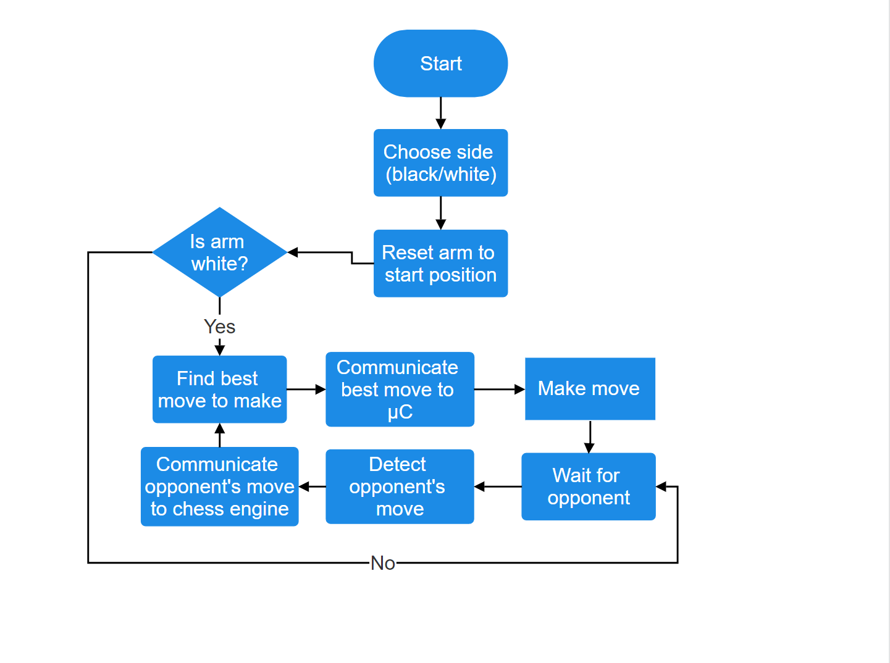

# How it Works
<!-- Add a block diagram of the system -->
The arm can be divided into three distinct components that work together to play chess.

1. The chess engine
2. The arm itself
3. The custom chess board

These three components are glued together using some Python code running on your computer (specifically, the code in the [`engine/`](https://github.com/hrushikeshrv/charm/tree/main/engine) directory) and some C++ code running on an Arduino Uno microcontroller (specifically, the code in the [`controller/`](https://github.com/hrushikeshrv/charm/tree/main/controller) directory). The Arduino Uno is connected to your computer via its standard USB cable, and to the arm as well as the chess board via its GPIO pins. The result is a robotic arm that can sit across the table from you and play a complete game of chess against you.

When it is the arm's turn to move, the chess engine is responsible for finding the best move to make in the current position. This step is done on the computer, since it is very computationally intensive, and an Arduino doesn't have enough power to find a good move in a reasonable amount of time. The engine then communicates the best found move to the Arduino Uno connected to your computer via a USB cable. The Arduino controls the movement of the arm and makes the move it received from the computer. When it is your turn to move, the custom-built chessboard automatically detects the move you make and communicates it to the Arduino. The Arduino forwards this move to the chess engine, which then comes up with a move in response, and the game loop continues.

## The Chess Engine
As part of this project, I decided to challenge myself to write a chess engine from scratch that I would use for the arm. I had no experience with chess-programming, and the result was, unsurprisingly, a lower-than-average elo chess engine that just barely manages to make sensible moves. However, I will be working on improving it regularly, and by the time you read this, it might actually be good.

The chess engine, named "chessengine", is written in Python, and features a bitboard representation with alpha-beta pruned search. At the time of writing, it can only search forward to a depth of 4 or 5 plies. It is not UCI compliant, but it does have [extensive documentation](https://chessengine.readthedocs.io/en/latest), and provides a convenient API to perform all the operations needed for this project.

Writing a chess engine is a huge project in itself, and chess programming is _very_ involved, so I won't describe the internals of chessengine here. If you're interested, I have described some of the internals in the documentation linked above. All that matters for this project is that the engine can search for moves and give you a move that it considers "best".

## The Arm
<!-- Add screenshots of the 3D model of the arm -->
I used Autodesk Inventor Professional to design the parts for the arm. It looks like a generic robotic arm, except it doesn't have motors to control the roll and yaw of the gripper. 

The simplest way to manufacture the parts for the arm is to get them 3D printed. Apart from the 3D printed parts, the arm needs the following components -

1. 1 x Arduino Uno
2. 2 x MG996R 10 kg-cm 180 degree servo motors
3. 1 x DS320MG 30 kg-cm 180 degree servo motor
4. 2 x SG90 1.2 kg-cm 180 degree micro servo motors
5. 2 x 6-9V Li-Po batteries (can be constructed with 2 or 3 Li-Po cells per battery)
6. Connecting wires

For assembly instructions, refer to the [assembly instructions](./assemble.md) page.

The computer sends the move to the Arduino Uno using serial communication. Using Python's `serial` library, a socket is opened to the USB port to which the Arduino is connected. The best move that the chess engine finds is then converted into a byte string and sent over the serial port of the computer, and received at the serial port of the Arduino. The following information is transmitted -

1. The start square of the move the arm should make
2. The end square of the move the arm should make
3. Whether this move is a capture. If it is, the arm should first pick up and remove the piece at the end square before starting to make its move.

Once the arm has made its move, it waits for the opponent to make a move. When this move is detected, the Arduino encodes the same information as a byte string, and sends the opponents move to the computer in the same format. The computer reads the move from the serial port and the game loop continues.

## The Chess Board
<!-- Add screenshots of the chess board -->
The custom chess board uses magnets to detect the position of pieces on the board, and communicates this state of the board to the Arduino. It can be built by customizing any standard chess board with a few electronic components. I used a large "mat" style chess board, as opposed to a rigid wooden board.

Since the gripper of the robotic arm is made specific to a particular chess board, make sure that you use a chess board where one square has a side of around 5 cm. If you want to make a chess board of dimensions significantly larger or smaller than 5 cm, you will have to modify the gripper mechanism of the arm to match those dimensions, which may be a complicated process.

In order to detect the position of pieces, the board uses [reed switches](https://en.wikipedia.org/wiki/Reed_switch) attached to the bottom of each square. A small circular ferrous magnet is attached to the bottom of each piece (neodymium magnets may be too strong for the switch), such that when a piece is placed on a square, the reed switch corresponding to that square is closed.

Since there are 64 reed switches, an Arduino Uno doesn't have nearly enough inputs to read all the reed switches at the same time. Instead, they are connected to 8 x 8-bit parallel-in serial-out shift registers, each of which converts the parallel input of 8 reed switches into one byte of serial data. This means that only 8 PISO registers are connected to the Arduino, and we can read the states of all 64 reed switches in groups of 8 instead of individually.

Once it is your turn, the Arduino continuously monitors the state of all the reed switches through the 8 shift registers. Once it detects that the state of exactly 2 reed switches has changed, it compares the previous state to the current, finds out which squares were changed, and sends the identified move to the computer. If it detects that more than two reed switches changed state for some reason, it sends an error message to the computer, so that it can inform the user.

The chess board needs the following components -

1. 1 x large-sized chess board (1 square of side 5 cm)
2. 64 x reed switches
3. 8 x PISO shift registers (e.g. 74HC165)
4. 64 x small circular ferrous magnets

For assembly instructions, refer to the [assembly instructions](./assemble.md) page.

## Putting it Together

The three components - the chess engine, the arm, and the chess board - communicate with each other using some Python code running on your computer, and some C++ code running on your Arduino Uno. The Python code running on your computer is responsible for running the chess engine, getting the best move, coordinating actions between the human player and the computer, and communicating with the Arduino.

The Arduino code is only responsible for controlling the arm, and for communicating with the chess board to detect which moves were made.

Once you have assembled the arm, the chess board, and built the circuit using the schematics, take a look at the [usage](./usage.md) page to start a game of chess with the arm.
